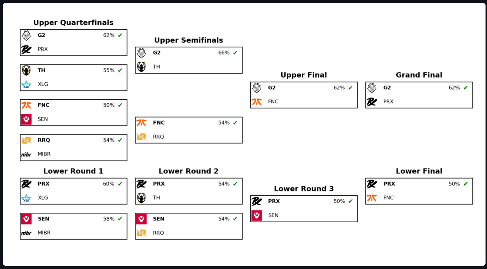

# Simulação de campeonato VCT (probabilidades)
Análise de probabilidade baseada em elo calculado dos playoffs do Masters Toronto 2025, com caminhos possíveis visualizados e simulação manual.

---
## Objetivos do projeto

O projeto tem como finalidade o desenvolvimento de um sistema de simulação probabilística dos playoffs do campeonato Valorant Masters Toronto 2025 (que começa dia 07/07), baseado em modelos estatísticos com rating elo ajustado pela diferença de rounds e pelos resultados recentes das 8 equipes participantes.
A partir desse sistema, foi criada uma interface interativa com todos esses cenários, e a possibilidade de simulação manual do campeonato.

Além de seu caráter exploratório e interativo, o projeto visa demonstrar a aplicação prática de técnicas de modelagem probabilística, simulação computacional e visualização de dados.

### Etapas do desenvolvimento

1. **Coleta de dados**: foi realizada a obtenção de resultados de partidas recentes das 8 equipes classificadas, com detalhamento por mapas, placares e número de rounds.
2. **Criação da tabela de partidas**: os dados foram organizados em um formato tabular padronizado, permitindo o cálculo de métricas consistentes entre os confrontos.
3. **Cálculo do elo ajustado**: desenvolveu-se um script de cálculo de rating (elo) que incorpora a diferença de rounds como fator de ajuste, proporcionando uma estimativa mais precisa da força relativa entre equipes.
4. **Simulação de cenários**: a partir dos ratings obtidos, foram simulados todos os caminhos possíveis de um torneio em formato *double elimination*, com estimativa da probabilidade cumulativa de cada cenário.
5. **Simulação Monte Carlo por fase**: para cada permutação de confrontos iniciais, foi aplicada uma simulação com 2.000 execuções a fim de estimar as chances de cada equipe alcançar semifinal, final e título.
6. **Construção da interface interativa (Streamlit)**: o sistema foi implementado em uma interface que permite tanto a simulação manual (tipo "pick’em") quanto a visualização gráfica automatizada dos cenários e estatísticas.
7. **Exportação e visualização**: foram incluídas funcionalidades de exportação em PNG e PDF, além da incorporação de tooltips explicativos e filtros dinâmicos para exploração dos dados.

---

## Cálculo de elo (força relativa)

O cálculo de probabilidades foi baseado na fórmula clássica de elo, ajustada para refletir a diferença de rounds entre os times.

### Fórmula de atualização do rating
```
R' = R + K × (S - E)
```
**Em que:**

- `R` = rating atual do time  
- `K` = fator de ajuste (K-factor)  
- `S` = resultado real (1 = vitória, 0 = derrota)  
- `E` = expectativa de vitória, calculada por:
```
E = 1 / (1 + 10^((Rb - Ra) / 400))
```

### Ajustes específicos

- O **K-factor** foi definido como `32`, com incremento proporcional à diferença de rounds entre os times. Vitórias muito dominantes (ex: 13x1) resultam em ajustes de Elo mais significativos.
- Jogos decididos por margem mínima (ex: 13x11) têm impacto reduzido, refletindo maior equilíbrio entre os times.

Essa abordagem torna a simulação mais realista ao capturar variáveis no desempenho além de vitória/derrota.

---

## Funções
A interface interativa é dividida em três seções principais:
### Simulador manual  
- **Escolha inicial dos confrontos** (G2, XLG, FNC, RRQ × adversários à escolha).  
- **Barra de progresso**, *Undo* e *Reset*.  
- **Probabilidade incremental** mostra quanto a chance acumulada mudou a cada resultado escolhido.
- **Tooltip de transparência** nas porcentagens, exibindo fórmula de Elo e valores dos times.
  
<p align="center">
  
</p>

---

### Caminhos e Bracket
- Lista de todos os cenários possíveis do campeonato (393,216)
- **Filtros:** equipe campeã, mais/menos provável geral, ordenação de mais/menos provável específico e quantidade de cenários mostrados.
- Visualização da chave Upper/Lower do campeonato com logos e percentuais (para cada caminho)
- Download da bracket em **PNG** ou **PDF**.
  
<p align="center">
  
</p>

<p align="center">

</p>
<p align="center"><em>^ exemplo de cenário gerado, é possível visualizar todos</em></p>

---

### Estatísticas por fase  
- Simulação Monte-Carlo para calcular probabilidade de:  
  *Semifinal → Final → Título* de cada equipe
- Gráfico de barras empilhadas exportável (PNG/PDF).  

<p align="center">
  
</p>

---
## 🗃️ Fontes de dados
| Arquivo                                           | Descrição                                                                 |
|---------------------------------------------------|---------------------------------------------------------------------------|
| `elo_final_campeonato.csv`                        | Elo final de cada time, gerado por `calculo_elo_completo.py`             |
| `caminhos.parquet`                                | Todos os caminhos Upper/Lower com probabilidade cumulativa (393,216)              |
| `tabela_partidas_vlr.csv`           | registro de partidas das equipes com resultado, número de rodadas e mapas                            |

---
## ⚙️ Scripts auxiliares

Abaixo estão os scripts que compõem o backend do projeto. Todos podem ser executados individualmente para testes ou geração de dados:

### `calculo_elo_completo.py`
Realiza o cálculo do **ELO atualizado** de cada time com base nos resultados recentes (incluindo diferença de rounds). Gera o arquivo `elo_final_campeonato.csv` que serve como base para todas as simulações posteriores.

- **Entrada:** tabela de partidas (`tabela_partidas_vlr.csv`)
- **Saída:** arquivo `elo_final_campeonato.csv`

---

### `converter_json_para_parquet.py`
Converte o arquivo de caminhos gerado (`caminhos_campeonato.json`) para o formato **Parquet**, otimizando a leitura no Streamlit.

- **Entrada:** `caminhos_campeonato.json`
- **Saída:** `caminhos.parquet`

---

### `simulador_caminhos.py`
Simula **todos os caminhos possíveis** do campeonato baseado no elo calculado. Armazena o resultado em JSON, permitindo visualizações futuras.

- **Requer:** `elo_final_campeonato.csv`
- **Gera:** `caminhos_campeonato.json`

---

### `simulador_campeonato.py`
Contém a **lógica recursiva principal** para simulação de confrontos, probabilidades e avanço nas chaves (Upper e Lower), gera a porcentagem de vezes que cada time ganhou em uma simulação de x campeonatos.

---

### `simulador_fases_grafico.py`
Executa **simulações Monte Carlo** de todas as permutações iniciais possíveis e calcula a probabilidade de cada time atingir fases específicas: **semifinal, final e título**.

- **Requer:** `elo_final_campeonato.csv`
- **Gera:** estrutura interna usada para gráficos no Streamlit

---

## Como rodar localmente
### Requisitos: python 3.9+

Clone o repositório
```bash
git clone https://github.com/felipekscld/probabilidades-vct.git
cd probabilidades-vct 
```
Instale as dependências
```bash
pip install -r requirements.txt
```
Execute o Streamlit
```bash
streamlit run src/app.py
```
---

## 🗂️ Estrutura do projeto

```text
.
├── data/                          # arquivos de dados usados pelo app
│   ├── caminhos.parquet           # todos os cenários 
│   ├── elo_final_campeonato.csv   # elo calculado de cada equipe
│   └── tabela_partidas_vlr.csv    # tabela com histórico de partidas das equipes
├── logos/                         # logos dos times (.png)
├── img/                          
├── src/                          
│   ├── app.py                     # Streamlit principal
│   ├── simulador_caminhos.py      # gera todos os cenários possíveis
│   ├── simulador_campeonato.py    # prob. de cada time ser campeão (automático, protótipo)
│   ├── simulador_fases_grafico.py # gráfico de prob. por fase
│   ├── calculo_elo_completo.py    # cálculo do elo baseado na tabela
│   └── converter_json_para_parquet.py # converte o .json dos caminhos para .parquet
├── requirements.txt
├── .gitignore
├── LICENSE
└── README.md
```

# Licença
[Licença MIT](LICENSE)
