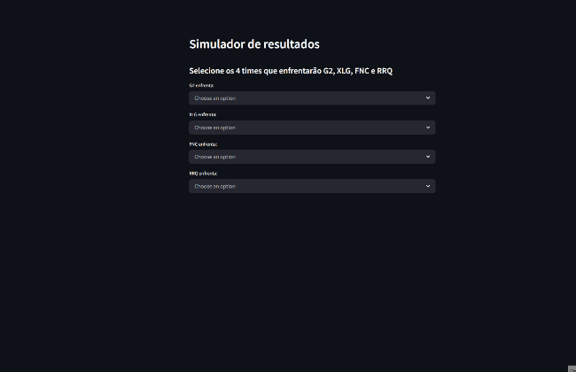
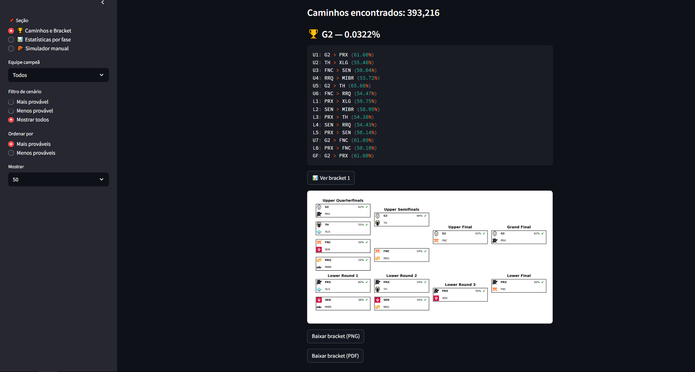
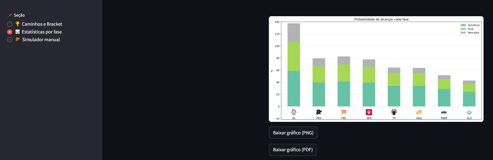

# Simulação de campeonato VCT (probabilidades)

Análise de probabilidade baseada em elo calculado dos playoffs do Masters Toronto 2025, com caminhos possíveis visualizados e simulação manual.


---

## Funções

### Simulador manual  
- **Escolha inicial dos confrontos** (G2, XLG, FNC, RRQ × adversários à escolha).  
- **Barra de progresso**, *Undo* e *Reset*.  
- **Probabilidade incremental** mostra quanto a chance acumulada mudou a cada resultado escolhido.
- **Tooltip de transparência** nas porcentagens, exibindo fórmula de Elo e valores dos times.
  
<p align="center">
  
</p>

---

### Caminhos e Bracket  
- Lista de todos os cenários possíveis do campeonato (393,216)
- **Filtros:** equipe campeã, mais/menos provável geral, ordenação de mais/menos provável específico e quantidade de cenários mostrados.
- Visualização da chave Upper/Lower do campeonato com logos e percentuais (para cada caminho)
- Download da bracket em **PNG** ou **PDF**.
  
<p align="center">
  
</p>

---

### Estatísticas por fase  
- Simulação Monte-Carlo para calcular probabilidade de:  
  *Semifinal → Final → Título* de cada equipe
- Gráfico de barras empilhadas exportável (PNG/PDF).  

<p align="center">
  
</p>

---

## Como rodar localmente
### Requisitos: python 3.9+

Clone o repositório
```bash
git clone https://github.com/felipekscld/probabilidades-vct.git
cd probabilidades-vct 
```
Instale as dependências
```bash
pip install -r requirements.txt
```
Execute o Streamlit
```bash
streamlit run src/app.py
```
---
## 🗂️ Fontes de dados
| Arquivo                                           | Descrição                                                                 |
|---------------------------------------------------|---------------------------------------------------------------------------|
| `elo_final_campeonato.csv`                        | Elo final de cada time, gerado por `calculo_elo_completo.py`             |
| `caminhos.parquet`                                | Todos os caminhos Upper/Lower com probabilidade cumulativa (393,216)              |
| `tabela_partidas.csv`           | registro de partidas das equipes com resultado, número de rodadas e mapas                            |

---

## ⚙️ Scripts Auxiliares

Abaixo estão os scripts que compõem o backend do projeto. Todos podem ser executados individualmente para testes ou geração de dados:

### `calculo_elo_completo.py`
Realiza o cálculo do **ELO atualizado** de cada time com base nos resultados recentes (incluindo diferença de rounds). Gera o arquivo `elo_final_campeonato.csv` que serve como base para todas as simulações posteriores.

- **Entrada:** tabela de partidas (`tabela_partidas_vlr.csv`)
- **Saída:** arquivo `elo_final_campeonato.csv`

---

### `converter_json_para_parquet.py`
Converte o arquivo de caminhos gerado (`caminhos_campeonato.json`) para o formato **Parquet**, otimizando a leitura no Streamlit.

- **Entrada:** `caminhos_campeonato.json`
- **Saída:** `caminhos.parquet`

---

### `simulador_caminhos.py`
Simula **todos os caminhos possíveis** de um campeonato *double elimination* com base nas probabilidades Elo. Armazena o resultado em JSON, permitindo visualizações futuras.

- **Requer:** `elo_final_campeonato.csv`
- **Gera:** `caminhos_campeonato.json`

---

### `simulador_campeonato.py`
Contém a **lógica recursiva principal** para simulação de confrontos, probabilidades e avanço nas chaves (Upper e Lower), gera a porcentagem de vezes que cada time ganhou em uma simulação de x campeonatos.

---

### `simulador_fases_grafico.py`
Executa **simulações Monte Carlo** de todas as permutações iniciais possíveis e calcula a probabilidade de cada time atingir fases específicas: **semifinal, final e título**.

- **Requer:** `elo_final_campeonato.csv`
- **Gera:** estrutura interna usada para gráficos no Streamlit


---

## 🗂️ Estrutura do projeto

```text
.
├── data/                          # arquivos de dados usados pelo app
│   ├── caminhos.parquet           # todos os cenários 
│   ├── elo_final_campeonato.csv   # elo calculado de cada equipe
│   └── tabela_partidas_vlr.csv    # tabela com histórico de partidas das equipes
├── logos/                         # logos dos times (.png)
├── img/                          
├── src/                          
│   ├── app.py                     # Streamlit principal
│   ├── simulador_caminhos.py      # gera todos os cenários possíveis
│   ├── simulador_campeonato.py    # prob. de cada time ser campeão (automático, protótipo)
│   ├── simulador_fases_grafico.py # gráfico de prob. por fase
│   ├── calculo_elo_completo.py    # cálculo do elo baseado na tabela
│   └── converter_json_para_parquet.py # converte o .json dos caminhos para .parquet
├── requirements.txt
├── .gitignore
├── LICENSE
└── README.md
```

# Licença
[Licença MIT](LICENSE)
